<h1 align="center">Hi 👋, I'm Vimaladhithyan aka MrTheMech</h1>

  

  

<h3 align="center">
  18 and already shaping tomorrow through tech. Not rich yet, but give it time.  
   My code runs on caffeine, late nights, and sheer willpower.  
   I'm not just learning - I’m engineering my future.  
   Inspired by legends, but I’m here to build my own legacy - one commit at a time.  
</h3>

<h3 align="left">Languages and Tools:</h3>

                </a>             

<h3 align="left">Detailed Overview:</h3>

<h3 align="left">Connect with me:</h3>

